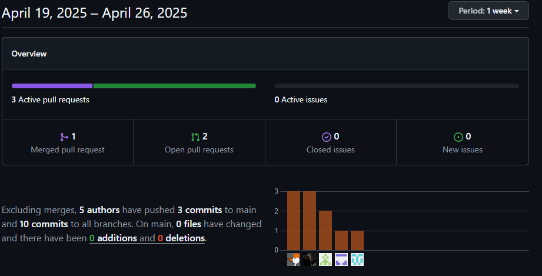
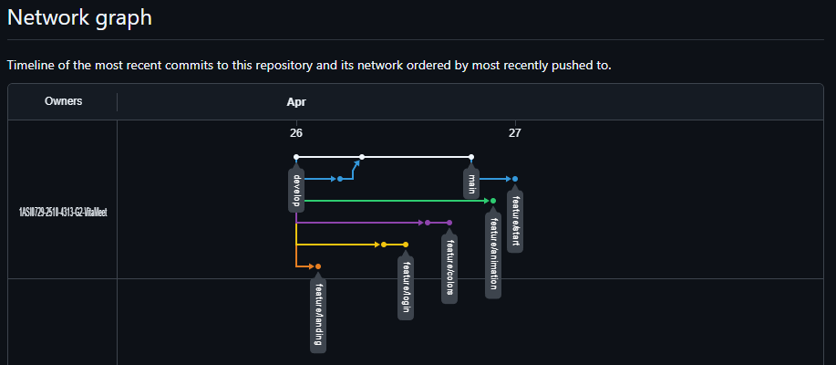

# Final-Report

# Capítulo V: Product Implementation, Validation & Deployment

## 5.1. Software Configuration Management.

En la siguiente sección, detallaremos las herramientas, convenciones, referencias y configuraciones empleadas a lo largo del desarrollo del proyecto, que contribuyeron a mantener la consistencia en el trabajo realizado.

### 5.1.1. Software Development Environment Configuration.

En este apartado, se van a mencionar los distintos productos de software empleados por el equipo de desarrollo, para llevar acabo las actividades relacionadas con la elaboración del proyecto.

**Project Management:**

1. **Discord: https://discord.com/** Aunque originalmente su uso es mas para la comunidad de gamers para comunicarse entre ellos, Discord también se puede utilizar para mejorar la experiencia del usuario a travez de diferentes lugares de comunicación, fijar mensajes, diferentes canales de texto y actividad de los integrantes del grupo.

2. **WhatsApp: https://web.whatsapp.com/** WhatsApp es una aplicación de mensajería instantánea que se utiliza para la comunicación en tiempo real. Aunque no es una herramienta de gestión de proyectos, se puede utilizar para mantener en contacto con los miembros del equipo. 

**Requirements Managemnts:**

1. **Trello: https://trello.com/** Es un software de gestión de proyectos, que facilita asignar y organizar las tareas a realizar. 

**Product UX/UI Design**

1. **Figma: https://www.figma.com/** Figma es una herramienta de edición gráfica, en donde se puede diseñar y prototipar páginas web. Se utilizó para crear los wireframes, mock-ups del proyecto

2. **UXPressia: https://uxpressia.com/** Es una herramienta en línea que permite a los equipos de trabajo identificar y comprender los problemas, necesidades y comportamiento del usuario, lo utilizamos para realizar el Empathy Map, Journey Map, Impact Map

3. **Miro: https://miro.com/es/** Es una plataforma colaborativa el cual permite crear y usar pizarras digitales personalizadas en tiempo real. Lo utilizamos para la creación del As-is y To-Be scenario map.

**Software Development:**

1. **Landing Page:** Para la creación de la landing page, se utilizaron las tecnologias base del desarrollo web: HTML5, CSS3 y JavaScript, Tambien se usó ReactJs y el framework Tailwindcss para facilitar el desarrollo del proyecto.

**Software Documentation:**

1. **GitHub: https://github.com/** GitHub es una plataforma de desarrollo colaborativo que utiliza el sistema de control de versiones Git. Se utiliza para alojar, revisar y colaborar en proyectos de desarrollo de software, lo que facilita la colaboración entre desarrolladores.

2. **LucidChart: https://lucid.app/** LucidChart es una plataforma que cuenta con opciones para la creación de diagramas, mapas mentales, flujos y más, con el uso de plantillas y tableros con edición en tiempo real. Fue utilizado en el desarrollo del diagrama de clases UML

3. **Structurizr: https://www.structurizr.com/** Es una plataforma que permite modelado de diagramas de arquitectura de software por medio de código. Structurizr fue utilizado para crear el modelo C4 de nuestro proyecto.

### 5.1.2. Source Code Management.

El manejo y organización del trabajo se llevaron a cabo mediante una organización en Github Organización: https://github.com/SI730-SW53-OpenSource-Grupo5 Landing Page Repository: https://github.com/SI730-SW53-OpenSource-Grupo5/LandingPage-ConnectionLink.git 

Asimismo, para llevar a cabo un mejor control de cómo crear ramas y realizar cambios en el código fuente, se procedió a utilizar GitFlow.

De este modo, se tenían 2 ramas principales: main y development.

* main: En esta rama almacenaremos las versiones oficiales de nuestro repositorio que ya deben pasar a producción.
* development: Esta rama se utilizará como rama de integración para las “feature” branches. Una vez alcance un estado estable y el equipo lo considere listo para ser lanzado, se unirá a la rama main.
  
**Commit Conventions:**    
El formato de nuestros commits sigue la estructura de los “Conventional Commits” en su versión 1.0.0 (https://www.conventionalcommits.org/en/v1.0.0/) con el objetivo de proporcionar una lectura sencilla de los mismos. Por ello seguimos el siguiente formato: "< type>[optional scope]: < description>" Donde:

* type: Especifica el tipo de cambio realizado, únicamente puede ser feat, fix, update, etc.
* scope: Es el alcance que tiene nuestro commit.
* description: Es un breve resumen de los cambios de código.

### 5.1.3. Source Code Style Guide & Conventions.
En el proyecto hemos hecho uso de algunas convenciones y guia de estilos para el desarrollo del Landing Page.

**React:**

   + Componentes: Se fomenta la creación de componentes para mantener un código limpio y modularizado.
   + Nomenclatura Descriptiva: Utilizamos nombres descriptivos para que se pueda entender cual es su función dentro de la página.
   + Estado y Props: Hacemos uso de los estados y props para pasar datos entre componentes y tener una página reactiva.

**Tailwind CSS:**
   + Clases Utilitarias: Usamos las clases proporcionadas por Tailwind para darle estilos a los elementos de forma eficiente.

**General:**
   + Estructura de Carpetas Organizadas: Mantenemos una estructura de carpetas organizadas para los archivos de React, facilitando así la navegación y entendimiento del proyecto. 

**Git:**
   + Ramas Descriptivas: Utilizamos  nombres de ramas descriptivas para una gestión eficiente del código y las versiones.
   + Flujo de Trabajo Colaborativo: Hacemos uso de ramas para el desarrollo colaborativo.

### 5.1.4. Software Deployment Configuration.

En esta entrega, hemos finalizado nuestra Landing Page y configurado su despliegue de la siguiente manera:

Repositorio GitHub: El código de la Landing Page está alojado en un repositorio específico dentro de nuestra comunidad pública en GitHub.

Vercel: Utilizamos la aplicación Vercel para desplegar la página. Esto nos permite una visualización clara y accesible para los usuarios.

Esta configuración nos brinda un método eficiente y transparente para el despliegue de nuestro proyecto, asegurando una experiencia óptima para nuestros usuarios.

## 5.2. Landing Page, Services & Applications Implementation.

### 5.2.1. Sprint 1

El primer sprint es una etapa importante en nuestro marco de gestión de proyectos de metodología ágil Scrum. En este periodo, agendamos reuniones con el objetivo de conocer mejor las características de cada integrante, y delegamos tareas para materializar el diseño y funcionalidades ya establecidas, para transformarlos en un landing page funcional y que cumple las heurísticas.

#### 5.2.1.1. Sprint Planning 1.

| Sprint 1                   | Implementación de funcionalidades y diseño de la aplicación.                                                                                                                                           |
|----------------------------|--------------------------------------------------------------------------------------------------------------------------------------------------------------------------------------------------------|
| Sprint Planning Background |                                                                                                                                                                                                        |
| Date                       | 10/04/2025                                                                                                                                                                                             |
| Time                       | 20:00                                                                                                                                                                                                  |
| Location                   | Reunión realizada en Discord                                                                                                                                         |
| Prepared By                |                                                                                                  Eddo Su Caletti                                              |
| Attendees                  |  Alexander Paolo Justo Yauricasa, Carlos De La Cruz Villarreal, Miguel Angel Vidal Castro, Fabian Alonso Reyes Trujillano, Ariana Ramirez Carrasco |
| Sprint Goal & User Stories |                                                                                                                                                                                                        |
  | Sprint 1 Goal              | Implementar y desplegar la landing page implica desarrollar una versión funcional basada en los diseños aprobados, integrando elementos clave como formularios, llamados a acción y seguimiento analítico.                                                                                                                                                                |
| Sprint 1 Velocity          |                                                 35               |
| Sum of Story Points        |                                                       30            |

#### 5.2.1.2. Sprint Backlog 1.

| Id   | Title            | Id   | Title                           | Description                                                                           | Estimations (Hours) | Assigned To                       | Status |
|------|------------------|------|---------------------------------|---------------------------------------------------------------------------------------|---------------------|-----------------------------------|--------|
| US16  | Navegación por la landing page     | US16  | Desarrollo del navegación por el Landing Page	 | Como visitante Quiero navegar por la landing page del software Para obtener la información que deseo del producto.	 | 5           |      | Done   |
| US17 | Acceder a la aplicación desde la landing page | US17  | Desarrollo del acceder a la aplicación desde la landing page       | Como visitante de la página Quiero poder acceder a la aplicación desde la landing page Para empezar a usarla.	                 | 6                   |  | Done   |
| TS18 | Cambiar el Idioma de la Landing Page | TS18  | Desarrollo del cambiar el Idioma de la Landing Page       | Como visitante de la página Quiero poder acceder a la aplicación desde la landing page Para empezar a usarla.	       | 5                   |  | Done   |
| TS19 | Contactar al Equipo de Soporte          | TS19  | Desarrollo del Contactar al Equipo de Soporte	      | Como visitante Quiero contactar al equipo de soporte Para obtener ayuda o resolver dudas sobre la plataforma.	      | 7                   |   | Done   |
| TS20 | Contactar al Equipo de Soporte           | TS20  | Desarrollo del Contactar al Equipo de Soporte      | Como desarrollador Quiero corregir los errores del software notificados por el equipo de QA Para mejorar la calidad del producto.	       | 7                   |   | Done   |

   
Link del trello: https://trello.com/b/E7ZyFdYk/vitameet

#### 5.2.1.3. Development Evidence for Sprint Review.

| Repository                 | Branch                   | Commit ID | Commit Message                                                                      | Commit Message Body | Commited On(Date) |
|----------------------------|--------------------------|-----------|-------------------------------------------------------------------------------------|---------------------|-------------------|
| Landing-Page | feature/start           |  6e1825098a9bb126828c89d3b7cd97a21aa0c9db  | feat: add files                                                                   | -                   | 27/04/2025        |
| Landing-Page | feature/animation          |  dbbde2c86106f3706e411b2abe7d1aa9cd727370  | feat(animation): group commit, added animations                                                                  | -                   | 27/04/2025        |
| Landing-Page | feature/colors           |  6caee6df6b32fe8659ac33c75f0c31341ff4e19a  | Add files via upload                                                                | -                   | 27/04/2025        |
| Landing-Page | feature/landing |  c31a8045ab6c04ce81b33465eb0802358323cda2  | feat: add landing                | -                   | 27/04/2025        |
| Landing-Page | feature/login    |  e09522ac580d84b9f1be39fbdb172e1b33a1ebc5  | feat:add login landing page Styles    Add images login| -                   | 27/04/2025        |
| Landing-Page | feature/     |    |  | -                   | 27/04/2025        |

#### 5.2.1.4. Testing Suite Evidence for Sprint Review.

| Repository          | Branch | Commit ID                                | Commit Message                     | Commit Message (Body) | Committed on (Date) |
|---------------------|--------|------------------------------------------|------------------------------------|-----------------------|---------------------|
| Acceptance-Test     | main   | c31a8045ab6c04ce81b33465eb0802358323cda2 | Initial commit                     | -                     | 13/04/2025          |
| Acceptance-Test     | main   | 6e1825098a9bb126828c89d3b7cd97a21aa0c9db | feat: Added us-16 acceptance test  | -                     | 27/04/2025          |
| Acceptance-Test     | main   | dbbde2c86106f3706e411b2abe7d1aa9cd727370 | feat: Added us-17 acceptance test  | -                     | 27/04/2025          |
| Acceptance-Test     | main   | 6caee6df6b32fe8659ac33c75f0c31341ff4e19a | feat: Added us-18 acceptance test  | -                     | 27/04/2025          |
| Acceptance-Test     | main   | e09522ac580d84b9f1be39fbdb172e1b33a1ebc5 | feat: Added us-19 acceptance test  | -                     | 27/04/2025          |
| Acceptance-Test     | main   | cd8cc231ff1973cbffd9adec1839191a5d98ea62 | feat: Added us-20 acceptance test  | -                     | 27/04/2025          |

#### 5.2.1.5. Execution Evidence for Sprint Review.

 

**Enlace a la página:** 

#### 5.2.1.6. Services Documentation Evidence for Sprint Review.

En este sprint 1, los miembros del equipo lograron completar satisfactoriamente todas las tareas propuestas. Este sprint estuvo enfocado principalmente en el desarrollo del landing pague. A lo largo del desarrollo, se realizaron múltiples correcciones a errores presentes en el código, lo que permitió mejorar.
- En el mundo de la programación una landing page es esencial para convertir visitantes en clientes, ya que está diseñada estratégicamente para guiar al usuario hacia una acción específica (como comprar, registrarse o descargar). A diferencia de un sitio web general, enfoca todo el contenido en un único objetivo, eliminando distracciones y optimizando la experiencia del usuario. Con elementos clave como un titular persuasivo, beneficios claros, testimonios y un llamado a la acción (CTA) destacado, aumenta significativamente las tasas de conversión y el retorno de inversión (ROI) de campañas de marketing.

#### 5.2.1.7. Software Deployment Evidence for Sprint Review.

Para este sprint presentado de la landing page se optó por varias herramientas para su desarrollo y despliegue en la web de manera pública.

* Git: Se utilizó para el control de versiones del código fuente.
* GitHub: Se utilizó para crear el repositorio de la landing page, donde se subió el código fuente.

#### 5.2.1.8. Team Collaboration Insights during Sprint.

Para documentar los avances de este Sprint, utilizamos GitHub. Uno de los integrantes del equipo configuró el repositorio inicial, generando múltiples ramas que permitieron trabajar en paralelo sin afectar el progreso de los demás. Clonamos el repositorio localmente con Git, implementamos los cambios necesarios y los subimos a GitHub. Al finalizar, registramos todas las modificaciones, las cuales quedarán disponibles en el repositorio para su revisión.

  

 

### 5.2.2. Sprint 2
#### 5.2.2.1. Sprint Planning 2

| Sprint 2                   | Correción de errores de la landing page e implementación  del frontend y fake API de la web application                                                                                                |
|----------------------------|--------------------------------------------------------------------------------------------------------------------------------------------------------------------------------------------------------|
| Sprint Planning Background |                                                                                                                                                                                                        |
| Date                       | 12/05/2025                                                                                                                                                                                             |
| Time                       | 16:00                                                                                                                                                                                                  |
| Location                   | Reunión realizada mediante Discord                                                                                                                                                                     |
| Prepared By                | Esteban Garcia, Nicolas Sebastian                                                                                                                                                                      |
| Attendees                  | Carlos Alejandro De La Cruz Villarreal, Alexander Paolo Justo Yauricasa, Ariana Lizeth Ramirez Carrasc,Fabian Alonso Reyes Trujillano,Miguel Angel Vidal Castro	 |
| Sprint Goal & User Stories |                                                                                                                                                                                                        |
| Sprint 2 Goal              | Elaboracion de un frontend de una citas de medicas                                                                                                                                                                 |
| Sprint 2 Velocity          | 45                                                                                                                                                                                                     |
| Sum of Story Points        | 41                                                                                                                                                                                                     |

#### 5.2.2.2 Sprint Backlog 2

| User Story |  | Work-Item/Task |  |  |  |  |
|------------|----------------|-------------|--------------------------------|-----------|------------------|--------|
| ID         | Title          | ID          | Title                          | Description                     | Estimation | Assigned To      | Status |
| US01       | Registrar usuario	 	 | W201       | Crear el componente de hilo  | Creación del componente que permita visualizar informacion mas especifica de cada hilo e implementacion del service y model. | 5 horas | Eddo  | Done   |
| US04       | Historial del paciente	 	 | W202     | Crear el componente de calendario  | Creación de componentes que permiten visualizar el calendario con los eventos a los que asistira un usuario o specialista e implementacion del service y model. | 5 horas | Fabian  | Done   |
| US09	       | Filtrar búsqueda de médicos	 	 | W203     | Crear el componente de cita | Creación del componente que permite agendar una cita privada en el perfil del especialista, e implementacion del service y model. | 5 horas | Miguel  | Done   |
| US12       | Calificar médico	 	 | W204        | Crear el componente de suscripcion | Creacion del componente que permite a los usuarios pagar una suscripcion. | 5 horas | Alexander | Done   |
| US16      | Ver mi perfil	 	 | W205        | Crear el componente de mensajeria | Creacion del componente que permite visualizar todas las conversaciones de un usuario o un especialista, implementacion de model y service.| 3 horas | Miguel  | Done   |
| US17       | Traducir idioma	 	 | W206       | Crear el componente de listado de hilos | Creacion del componente para visualizar hilos en el foro e implementacion de model y service. | 5 horas | Ariana  | Done   |
| US18       | Actualizar correo electrónico		 | W207        | Crear el componente de perfil de especialista | Creacion del componente que permite visualizar el perfil de un especialista e implementación de model y service. | 5 horas | Carlos  | Done   |

#### 5.2.2.3. Development Evidence for Sprint Review.

| Repository              | Branch                     | Commit ID | Commit Message                                                 | Commit Message Body | Commited On(Date) |
|-------------------------|----------------------------|-----------|----------------------------------------------------------------|---------------------|-------------------|
| Frontend | feature/calendar           | 9f3f1e1   | feat: calendar component added                                 | -                   | 15/05/2025        |
| Frontend | feature/events             | 1bba0a4   | update: responsive event component                             | -                   | 15/05/2025        |
| Frontend | feature/payment            | cf72c8b   | Add files via upload                                           | -                   | 15/05/2025        |
| Frontend | feature/analytics          | cea366a   | feat: analytics component added without data                   | -                   | 15/05/2025        |
| Frontend | feature/specialist-profile | 6160b9e   | feat: add extra configurations                                 | -                   | 15/05/2025        |
| Frontend | feature/home               | 50e024c   | Update home                                                    | -                   | 15/05/2025        |
| Frontend | feature/forums             | 7add9b1   | feat: refresh button clean inputs and add styles to containers | -                   | 15/05/2025        |
| Frontend | feature/specialist-inbox   | ed2da55   | feature(inbox)                                                 | -                   | 15/05/2025        |

#### 5.2.2.5. Execution Evidence for Sprint Review.

 

#### 5.2.2.6. Services Documentation Evidence for Sprint Review

- En el mundo de la programación y el desarrollo web, los endpoints juegan un papel crucial en la comunicación entre el cliente y el servidor. Imagina un endpoint como un punto de entrada específico en una aplicación o servicio web, similar a una puerta de acceso en un edificio con múltiples habitaciones. Cada endpoint está asociado con una ruta única, que generalmente se expresa como una URL. Cuando un cliente, como un navegador web o una aplicación móvil, envía una solicitud a un servidor, especifica el endpoint al que desea acceder. El servidor, a su vez, procesa esa solicitud y responde con la información o la acción correspondiente. Los endpoints actúan como controladores de tráfico, dirigiendo y gestionando las solicitudes de los usuarios hacia las partes relevantes de la aplicación. Cada endpoint puede ofrecer diferentes funcionalidades, desde mostrar información estática hasta realizar operaciones complejas en la base de datos. Al definir y documentar endpoints, los desarrolladores proporcionan una guía clara sobre cómo interactuar con su aplicación. Esto facilita a otros desarrolladores entender cómo integrar su aplicación en la suya, así como a los usuarios comprender qué acciones pueden realizar y cómo hacerlo.
  
| Endpoint   | Detalles                                                                                     |
|------------|----------------------------------------------------------------------------------------------|
| /home      | En esta ruta se muestra la primera vista del servicio.                                       |
| /forums    | En esta ruta se muestran los foros donde los usuarios pueden discutir diversos temas.        |
| /event     | En esta ruta se muestran detalles específicos sobre un evento en particular.                 |
| /perfil    | En esta ruta se muestran detalles del perfil.                                                |

#### 5.2.2.7. Software Deployment Evidence for Sprint Review.

Para el sprint presentado de la landing page se optó por varias herramientas para su desarrollo y despliegue en la web de manera pública.

* Git: Se utilizó para el control de versiones del código fuente.
* GitFlow: Se utilizó para ver el avance de los integrantes del equipo.
* GitHub: Se utilizó para crear el repositorio de la landing page, donde se subió el código fuente.
* Vercel: Se utilizó esta herramienta ya que nos ofrece un despliegue sin costo de manera rápida y fácil, además que se puede vincular directamente con el repositorio de GitHub.
* Angular Material: Libreria de Angular que funciona como una cpaa frontend para desarrollar aplicaciones de una manera rapida, flexible y de fácil implementación. Contiene una gran variedad de componentes de interfaz de usuario lo que ayuda a diseñar una aplicación mas estructurada https://material.angular.io/
* Angular: Es un framework para aplicaciones web basado en Typesrcipt, de codigo abierto, actualmente mantenido por Google, que se utiliza para crear aplicaciones web se una sola pagina como enfoque principal (SPA), para este caso utilizamos la version Angular 17, la ultima version, la cual trabaja con standalones. https://angular.io/
* Webstorm: Es un entorno de desarrollo que nos permitirá trabajar con Javascript / Typescript y desarrollar la aplicacion web. https://www.jetbrains.com/es-es/webstorm/learn/

#### 5.2.2.8. Team Collaboration Insights during Sprint.

Para llevar a cabo los registros de nuestros avances durante el primer Sprint de desarrollo, empleamos GitHub. Un miembro del equipo inició el proceso con un primer registro para establecer el repositorio y creó muchas ramas para poder trabajar sin interrumpir el avance de otro compañero. Posteriormente, hicimos una copia local del repositorio mediante Git, realizamos las modificaciones en GitHub. Finalmente, completamos el proceso con un registro de los cambios, el cual será examinado en el repositorio de GitHub.

* A través de GitHub es donde se registran problemas. La sección de "Issues" en GitHub sirve como un tablero virtual donde los colaboradores registran problemas, errores o mejoras que necesitan ser abordados en un proyecto web. Estas entradas proporcionan una manera estructurada de organizar y priorizar el trabajo, facilitando la comunicación entre los miembros del equipo. 

  
