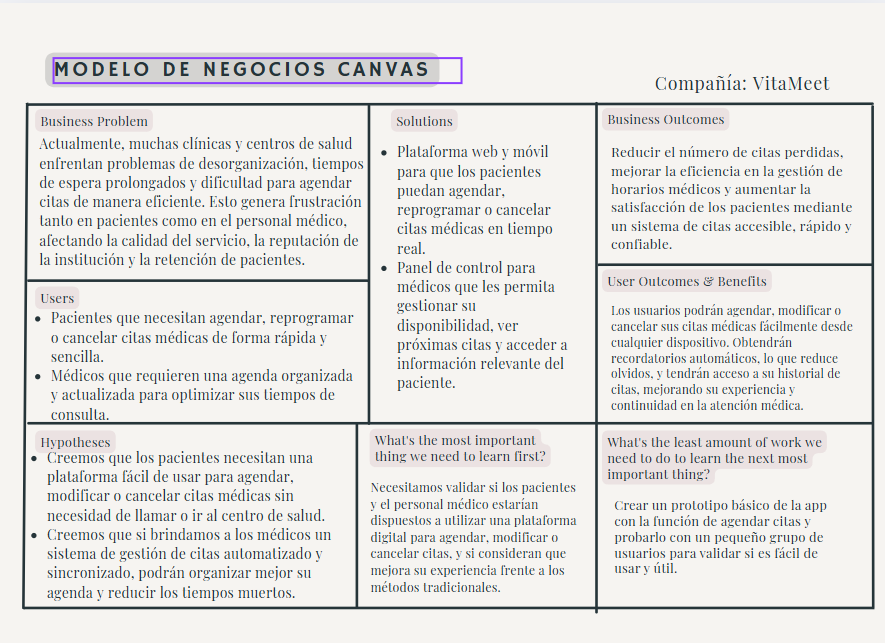

# Capítulo I: Introducción

La introducción desempeña un papel fundamental en la estructuración y comprensión del proyecto, ya que establece el marco conceptual y contextual sobre el cual se desarrollará el trabajo. En esta sección inicial, se presenta una visión general que permite al lector comprender los objetivos principales que se desean alcanzar, así como los antecedentes que han llevado a la formulación del proyecto. También se delimita el alcance del mismo, es decir, hasta dónde se pretende llegar con el desarrollo de la propuesta. Asimismo, la introducción cumple la función de contextualizar la relevancia del proyecto en un entorno específico, destacando las razones que justifican su realización, los desafíos que se pretenden abordar y los beneficios esperados a partir de su implementación. En suma, esta parte inicial no solo informa, sino que también orienta y motiva al lector a profundizar en el contenido que se presentará a lo largo del documento.

## 1.1. Startup Profile

El **Startup Profile** ofrece una visión clara y concisa sobre la identidad y dirección estratégica de la empresa emergente. A través de esta sección, se busca comprender su propuesta de valor, los principios que la sustentan y las motivaciones que impulsaron su creación.

Se presentan aspectos clave como el origen del proyecto, el problema que pretende resolver, y cómo su enfoque innovador la diferencia en el mercado. Además, se destacan sus objetivos a mediano y largo plazo, así como las estrategias adoptadas para crecer, adaptarse y generar un impacto positivo en el sector al que pertenece.

### 1.1.1. Descripción de la Startup

Nuestra startup tiene como objetivo transformar la experiencia de los pacientes y profesionales de la salud al momento de gestionar citas médicas. Buscamos ofrecer una plataforma web intuitiva, segura y accesible que permita a los pacientes agendar, modificar o cancelar sus citas médicas de manera rápida y desde cualquier dispositivo. A su vez, brindamos a los médicos una herramienta eficiente para organizar su agenda, consultar historiales clínicos, y comunicarse de forma ordenada con sus pacientes. Nuestra propuesta se enfoca en mejorar la eficiencia, reducir las ausencias y optimizar la atención médica a través de funcionalidades automatizadas como recordatorios y notificaciones.

### 1.1.2. Perfiles de integrantes del equipo

|                                               |                                                                                                                                                                                                                                                                                                                                                                                                                                                                                                                                                  |
|-----------------------------------------------|--------------------------------------------------------------------------------------------------------------------------------------------------------------------------------------------------------------------------------------------------------------------------------------------------------------------------------------------------------------------------------------------------------------------------------------------------------------------------------------------------------------------------------------------------|
|  | Me llamo Eddo Su Caletti estudió la carrera de ingeniería de software estoy en el 5 ciclo me considero una persona amable y graciosa me encanta salir con mis amigos a pasear en bici o jugar videojuegos además espero poder ser de ayuda para mis compañeros con todos los problemas que ellos tengan. |
|  | Me llamo Ariana tengo 19 años y actualmente me estoy formando en la Universidad Peruana de Ciencias Aplicadas. Me considero una persona curiosa, tanto en el ámbito tecnológico como en la gestión y dirección de proyectos. Mis principales experiencias están relacionadas con el liderazgo y el manejo de equipos bajo marcos de trabajo agiles, el análisis de datos y el desarrollo con enfoque web. Espero que mi compromiso y mis ganas de enseñar logren hacer que el proyecto tome un direccionamiento hacia el éxito.Tengo 19 años y actualmente me estoy formando en la Universidad Peruana de Ciencias Aplicadas. Me considero una persona curiosa, tanto en el ámbito tecnológico como en la gestión y dirección de proyectos. Mis principales experiencias están relacionadas con el liderazgo y el manejo de equipos bajo marcos de trabajo agiles, el análisis de datos y el desarrollo con enfoque web. Espero que mi compromiso y mis ganas de enseñar logren hacer que el proyecto tome un direccionamiento hacia el éxito.                                                                                                                                                                                             |
|  |Me llamo Carlos soy un estudiante de Ingeniería de Software, tengo 22 años y vivo en Lima. Mis pasatiempos son hacer deporte, jugar videojuegos y escuchar música. Me gusta trabajar en equipo porque de esta manera todos los integrantes podemos dar nuestro punto de vista e ideas para poder lograr el objetivo del curso. Además, para este curso me comprometo a ayudar en todo lo posible para la elaboración y desarrollo del trabajo.|
|    | Me llamo Alexander soy estudiante de Ingeniería de Software en la UPC. Me considero alguien responsable y altamente motivado para completar todos mis trabajos académicos. Me comprometo a cumplir con mis tareas y a alentar a mis compañeros de equipo para alcanzar los objetivos del curso.|                                                                                             |
|  | Me llamo Miguel tengo 19 años y estudio la carrera de ingeniería de Software, cursando en el 5to ciclo. Mi hobbie es la programación y entrenar. Siempre estoy dispuesto a ofrecer mi ayuda a mis compañeros cuando la necesiten, para así mantener un buen trabajo grupal. Me considero una persona colaborativa y me comprometo a aportar al equipo siempre que se necesite.| 
|  | Me llamo Fabian tengo 19 años. Soy estudiante de la carrera de ingenieria de software. Soy una persona segura de sí misma, capaz de tomar decisiones importantes y brindar ideas rápidas para solucionar un problema. Tengo conocimientos intermedios en C++, Python, HTML.| 

## 1.2. Solution Profile

**VitaMeet** es una plataforma web diseñada para optimizar y transformar la forma en que los pacientes acceden a servicios de salud, conectándolos de manera eficiente con médicos generales y especialistas. Su objetivo principal es digitalizar el proceso de gestión de citas médicas, reducir los tiempos de espera, mejorar la organización de agendas médicas y asegurar una atención oportuna y segura para todos los usuarios.

La plataforma aborda problemas comunes como la desorganización de agendas, la falta de disponibilidad visible en tiempo real, la informalidad en la reserva de consultas y la escasa trazabilidad de la atención médica. Con una interfaz intuitiva y procesos automatizados, esta solución mejora significativamente la experiencia tanto de pacientes como de profesionales de la salud.

** Características Principales** 

**- Asignación Inteligente de Citas**  
Los pacientes pueden buscar disponibilidad según especialidad, médico, ubicación o fecha. A través de filtros personalizables, el sistema muestra las opciones más adecuadas, permitiendo una reserva rápida y clara.

**- Gestión de Agenda Médica Digitalizada**  
Los médicos pueden administrar su disponibilidad desde cualquier dispositivo. La plataforma permite bloquear fechas, reprogramar, gestionar cancelaciones y acceder a un historial completo de citas, reduciendo errores administrativos y mejorando la eficiencia en la atención.

**- Confirmación y Recordatorios Automatizados**  
Cada cita queda registrada formalmente con un comprobante digital. Además, se envían recordatorios automáticos por correo o mensaje para reducir ausencias y olvidos.

**- Historial Médico y Seguimiento de Atención**  
Los pacientes pueden revisar su historial de citas, diagnósticos y tratamientos recibidos, mientras que los médicos pueden llevar un seguimiento más preciso de la evolución de cada caso.

**- Seguridad y Confidencialidad**  
Toda la información es protegida bajo protocolos de seguridad que garantizan la privacidad de los datos personales y médicos, cumpliendo con las normativas vigentes sobre salud digital.

**- Evaluación del Servicio**  
Luego de cada cita, los usuarios pueden valorar la calidad de atención recibida, lo que fomenta la mejora continua de los profesionales y permite mantener altos estándares en el servicio ofrecido.

La plataforma representa un paso firme hacia la transformación digital en el sector salud, facilitando el acceso a atención médica confiable y moderna para todos los actores involucrados.
### 1.2.1 Antecedentes y problemática
A continuación se presenta un análisis estructurado del problema mediante el modelo de las **5W y 2H**, el cual permite identificar con precisión los aspectos fundamentales que motivaron el desarrollo de la plataforma **VitaMeet**.

| **5W / 2H**     | **Pregunta**                                 | **Descripción**                                                                                                                                                                                                                                                                                  |
|----------------|----------------------------------------------|--------------------------------------------------------------------------------------------------------------------------------------------------------------------------------------------------------------------------------------------------------------------------------------------------|
| **Who?**       | ¿Quién es afectado?                          | Pacientes que necesitan atención médica oportuna y accesible, y profesionales de la salud (médicos generales y especialistas) que enfrentan dificultades para organizar eficientemente su agenda y brindar un servicio estructurado y moderno.                                                  |
| **What?**      | ¿Cuál es el problema?                        | La falta de una herramienta digital centralizada para gestionar citas médicas de manera ágil, confiable y automatizada. Esto ocasiona ausencias frecuentes, confusión en horarios, duplicidad de citas, y pérdida de tiempo tanto para pacientes como para médicos.                           |
| **When?**      | ¿Cuándo sucede el problema?                  | Este problema ocurre de forma constante, especialmente durante el proceso de programación de citas, ya sea al momento de solicitar una nueva atención o al intentar reprogramar o cancelar una existente. Las fallas del sistema actual afectan la experiencia diaria de usuarios y médicos.   |
| **Where?**     | ¿Dónde surge el problema?                    | En clínicas, centros médicos y consultorios, tanto públicos como privados, especialmente en zonas urbanas donde hay alta demanda de atención médica pero poca digitalización de los procesos administrativos. La solución puede ser aplicada desde cualquier lugar con acceso a internet.       |
| **Why?**       | ¿Cuál es la causa del problema?              | El sistema de gestión de citas en muchos centros de salud sigue siendo manual o dependiente de llamadas, lo que provoca ineficiencias, errores administrativos y falta de trazabilidad. Además, no existen soluciones accesibles y adaptadas al contexto local del paciente y el médico.        |
| **How?**       | ¿Qué llevó a la persona a esta situación?    | Los pacientes se enfrentan a tiempos de espera prolongados, trámites engorrosos y la necesidad de acudir presencialmente para agendar una cita. Por su parte, los médicos lidian con agendas desordenadas, poca flexibilidad y herramientas no integradas. VitaMeet busca resolver esta brecha. |
| **How Much?**  | ¿Cuál es la cantidad, duración o intensidad del evento? | Las clínicas o centros médicos pueden registrar decenas o cientos de citas por semana. Sin una herramienta adecuada, la tasa de inasistencia puede superar el 25%, según estudios del sector. Esto genera pérdidas económicas y un uso ineficiente de los recursos de salud disponibles.         |
### 1.2.2 Lean UX Process

El proceso Lean UX es una metodología ágil enfocada en crear productos digitales centrados en las necesidades reales de los usuarios. Este enfoque se basa en la colaboración continua entre equipos multidisciplinarios, ciclos rápidos de prueba y error, y una validación constante de las ideas antes de invertir grandes recursos en el desarrollo. Aplicado a nuestra plataforma de gestión de citas médicas, Lean UX nos permite construir soluciones útiles y efectivas de forma iterativa, reduciendo riesgos y asegurando que cada funcionalidad responda a un problema real del paciente o del médico.

### 1.2.2.1 Lean UX Problem Statements

# VitaMeet: Plataforma de Gestión de Citas Médicas

En el sistema de salud peruano, los pacientes enfrentan dificultades constantes para agendar o cancelar citas médicas, debido a procesos lentos, presenciales o dependientes de llamadas telefónicas. Esta falta de accesibilidad y eficiencia genera frustración, pérdida de tiempo y una alta tasa de ausentismo. Por su parte, los médicos también sufren complicaciones al gestionar su agenda sin herramientas digitales adecuadas, lo que afecta la calidad del servicio y aumenta la carga administrativa.

**VitaMeet** es una plataforma web diseñada para modernizar la gestión de citas médicas, conectando de forma eficiente a pacientes y médicos. Los pacientes pueden agendar, modificar o cancelar citas desde cualquier dispositivo, recibir recordatorios automáticos y consultar su historial médico. Los médicos, por su parte, tienen acceso a una herramienta que les permite organizar su disponibilidad, gestionar consultas y registrar observaciones de manera estructurada.

La plataforma busca reducir el ausentismo, disminuir la carga operativa en los centros de salud y brindar una experiencia médica más ordenada, accesible y centrada en el usuario, tanto para el paciente como para el profesional.

### 1.2.2.2 Lean UX Assumptions

**Business Assumptions**
- La demanda de plataformas digitales para citas médicas está en crecimiento.
- Los médicos están dispuestos a usar herramientas digitales que faciliten la gestión de su agenda.
- Ofrecer planes gratuitos y premium atraerá tanto a usuarios como a profesionales médicos.

**Business Outcomes Assumptions**
- Aumentar el número de usuarios registrados mensualmente.
- Reducir las ausencias a las citas en un 30% gracias a los recordatorios automatizados.
- Conseguir un porcentaje de conversión del 15% de usuarios gratuitos al plan premium.

**User Assumptions**
- Los pacientes quieren una forma sencilla, rápida y accesible de agendar citas sin tener que llamar o acudir físicamente al centro médico.
- Los médicos necesitan una agenda digital confiable y con recordatorios.
- Los usuarios valoran recibir notificaciones y seguimiento médico.

**User Outcomes Assumptions**
- Los pacientes usarán la plataforma al menos dos veces al mes para agendar o gestionar sus citas.
- Los médicos utilizarán diariamente el sistema para revisar y administrar su agenda.
- Los usuarios que reciban notificaciones asistirán puntualmente a sus citas en un mayor porcentaje.

### 1.2.2.3 Lean UX Hypothesis Statements

- *Creemos que* si ofrecemos una plataforma intuitiva para la gestión de citas médicas,  
  *Entonces* los pacientes la utilizarán para agendar y asistir puntualmente a sus citas,  
  *Porque* les brindará comodidad, accesibilidad y organización, reduciendo la necesidad de llamadas o visitas presenciales.

- *Creemos que* si proporcionamos a los médicos una agenda digital con alertas, historial de pacientes y gestión de disponibilidad,  
  *Entonces* ellos podrán organizar mejor su tiempo y atender más eficazmente,  
  *Porque* tendrán una herramienta centralizada que facilita su trabajo diario y la comunicación con sus pacientes.

### 1.2.2.4 Lean UX Canvas

Lean UX Canvas es una guía visual para crear, probar y mejorar ideas de productos enfocadas en el usuario.

## 1.3. Segmentos Objetivo

Los segmentos objetivo son grupos específicos de usuarios a los que se dirige un producto o servicio en particular.

Los segmentos objetivos identificados para nuestra plataforma de gestión de citas médicas se presentan a continuación:

| Segmento Objetivo                                     | Características Demográficas                                                                                                                                                      | Información estadística de sustento                                                                                                                                                                                                                                                                                                                                                      |
|--------------------------------------------------------|--------------------------------------------------------------------------------------------------------------------------------------------------------------------------------------|-------------------------------------------------------------------------------------------------------------------------------------------------------------------------------------------------------------------------------------------------------------------------------------------------------------------------------------------------------------------------------------------|
| **Pacientes: Personas adultas que necesitan atención médica** | Edad: 18 a 60 años.   Género: Varía.   Ubicación: Áreas urbanas y semiurbanas.   Tecnología: Uso frecuente de smartphones e internet.   Necesidad: Atención médica general o especializada. | Según el Instituto Nacional de Estadística e Informática (INEI, 2023), el 73% de los adultos peruanos utiliza internet para acceder a información o servicios de salud, lo que evidencia una alta disposición para el uso de plataformas digitales en el ámbito médico. [INEI, 2023](https://www.inei.gob.pe)                                                                                                            |
| **Médicos: Generales y especialistas con experiencia**       | Edad: 30 a 60 años.   Experiencia: Más de 10 años.   Tipo: Médicos generales y especialistas (pediatría, ginecología, geriatría, etc.).   Interés: Gestionar agenda, reducir ausencias, mejorar la atención. | De acuerdo con el Colegio Médico del Perú (2022), el 68% de los médicos encuestados considera que el uso de plataformas digitales mejora la organización de su agenda y la calidad de la atención al paciente, especialmente en consultas generales y especializadas. [Colegio Médico del Perú, 2022](https://www.cmp.org.pe)                                                                                          |

    
