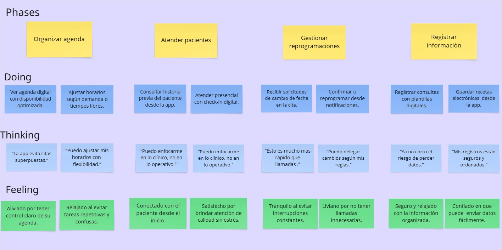

# Capítulo III: Requirements Specification

## To-Be Scenario Mapping.

Segmento 1: Personas adultas que necesitan atención médica

Segmento 2: Médicos generales y especialistas con experiencia

## User Stories.
| Epic/Story ID | Titulo | Descripción | Criterios de Aceptación | Relacionado con (Epic ID)|
|-------|-----------------|----------------------------|----------------------------------------|---------|
| EP01 | Landing page de la aplicación Vitameet | Como médico/paciente de Vitameet Quiero ingresar en la landing page Para informarme sobre la aplicación y su equipo de desarrollo | No corresponde | No corresponde |
| EP02 | Registrar Usuario | Como médico/paciente Quiero poder registrarme y autenticar mi cuenta Para mayor seguridad | No corresponde | No corresponde |
| EP03 | Loguear usuario | Como médico/paciente Quiero poder iniciar sesión y reestablecer mi contraseña Para poder entrar en la aplicación | No corresponde | No corresponde |
| EP04 | Gestion cuenta de usuario | Como médico/paciente Quiero poder editar mis datos de cuenta o eliminar mi cuenta Para poder manejar mi cuenta a mi gusto. | No corresponde | No corresponde | 
| EP05 | Buscar medicos especializados | Como paciente Quiero poder buscar y filtrar médicos Para poder escoger el más óptimo para mi | No corresponde | No corresponde | 
| EP06 | Gestionar valoraciones del médico | Como paciente Quiero poder visualizar y generar reseñas sobre médicos Para mejorar la calidad de las citas médicas. | No corresponde |  No corresponde |
| EP07 | Gestionar servicios de pago de citas médicas | Como paciente Quiero poder separar y pagar las citas médicas Para poder atenderme generando un comprobante de pago | No corresponde | No corresponde |
| EP08 | Visualizar la información del servicio del médico | Como paciente Quiero poder visualizar el historial de pacientes atendidos y las métricas del doctor Para estar seguro de escoger el médico correcto | No corresponde | No corresponde | 
| EP09 | Gestionar citas médicas e historial de pacientes | Como médico Quiero poder visualizar las citas médicas programadas y acceder al historial médico del paciente Para poder atender de forma óptima | No corresponde | No corresponde | 
| US01 | Implementación de la sección “Home” en la Landing Page | Como usuario de la plataforma web Quiero poder visualizar la sección "Home" de la landing page para tener una primera vista del producto | Scenario 1: Visualizar Sección Home    Dado que el visitante ingresa a la página Cuando la página cargue Entonces se muestra una sección llamativa que anime al usuario a usar la aplicación.   Scenario 2: Error en el sistema   Dado que el usuario se encuentre dentro de la landing page Cuando ocurra algún problema con el sistema Entonces no se muestra la sección Home Y se muestra un mensaje de error. | EP01 | 
| US02 | Implementación de la sección “About us” en la Landing Page | Como usuario de la plataforma Quiero visualizar la sección "About us" de la landing page Para tener información de la startup. | Scenario 1: Acceder a la sección "About us"   Dado que el visitante se encuentre dentro de la landing page Cuando navegue hasta la sección “About us” Entonces se muestra información importante sobre la startup.   Scenario 2: Error en el sistema   Dado que el visitante se encuentre dentro de la landing page Cuando ocurra algún problema con el sistema Entonces no se muestra la sección "About us" Y se muestra un mensaje de error.| EP01 | 
| US03 | Implementación de la sección "Services" en la Landing Page | Como usuario de la plataforma Quiero visualizar la sección "Services" en la landing page Para tener información de los servicios ofrecidos por la aplicación | Scenario 1: Acceder a la sección "Services"   Dado que el usuario se encuentre dentro de la landing page Cuando navegue hasta la sección “Services” Entonces se muestra información sobre los servicios que ofrece Smart Garden.   Scenario 2: Error en la sección   Dado que el usuario se encuentre dentro de la landing page Cuando ocurra algún problema con el sistema Entonces no se muestra la sección "Services" Y se muestra un mensaje de error. | EP01 |
| US04 | Implementación de la sección "Plans" en la Landing Page | Como usuario de la plataforma Quiero visualizar los planes de suscripción Para tener información de las membresías | Scenario 1: Acceder a la sección "Plans"   Dado que el usuario se encuentre dentro de la landing page Cuando navegue hasta la sección “Plans” Entonces se muestra la información relacionada a las membresías de pago que se ofrecen y cuáles son los beneficios de cada uno de estos.   Scenario 2: Error en la sección.   Dado que el usuario se encuentre dentro de la landing page Cuando ocurra algún problema con el sistema Entonces no se muestra la sección "Plans" Y se muestra un mensaje de error. | EP01 | 
| US05 | Implementación de la sección "About the Team" en la Landing Page. | Como usuario Quiero conocer al equipo detrás de la startup Para entender la experiencia y misión de la plataforma. | Scenario 1: Conocer al equipo en "About the Team"   Dado que el usuario se encuentre dentro de la landing page Cuando navegue hasta la sección “About the Team” Entonces se muestra la información correspondiente a los videos about the project y about the team, además de la información de cada uno de los miembros.   Scenario 2: Error en la sección   Dado que el usuario se encuentre dentro de la landing page Cuando ocurra algún problema con el sistema Entonces no se muestra la sección "About the Team" Y se muestra un mensaje de error. | EP01 | 
| US06 | Implementación de las reseñas de la landing page. | Como usuario Quiero conocer las reseñas de otra personas usando la plataforma Para saber si me conviene usarlo | Scenario 1: Conocer al equipo en "About the team"   Dado que el usario se encuentre dentro de la landing page Cuando navegue hasta el apartado de reseñas Entonces verá las opiniones de otros usuarios con respecto a la plataforma   Scenario 2: Error en la Reseña   Dado que el usuario se encuentre dentro de la landing page Cuando ocurra algún problema con el sistema Entonces te mostrará un mensaje de error en la sección "About the team". | EP01 |
| US07 | Landing Page Responsive a diferentes tamaños de pantalla. | Como usuario de la página Quiero que la landing page sea resposive Para que se vea bien en dispositivos móviles y escritorios. | Scenario 1: Ver la landing page en diferentes entornos   Dado que soy un usuario usando un dispositivo móvil o escritorio Cuando accedo a la landing page Entonces la página debe adaptarse al tamaño de mi pantalla.   Scenario 2: La landing page será una mala experiencia para los usuarios   Dado que el usuario se encuentre dentro de la landing page Cuando abra la pltaforma desde mi celular Entonces no podré ver bien la plataforma porque estará distorsionado y feo | EP01 |
| US08 | Acceder a la aplicación desde la landing page | Como usuario de la página Quiero poder acceder a la aplicación desde la landing page Para empezar a usarla. | Scenario 1: Acceder a la aplicación   Dado que soy un usuario Cuando hago clic en "Comienza ya" Entonces debería ser redirigido a la página de inicio de sesión de la aplicación.   | EP01 |

 

## Impact Mapping.

Segmento 1: Personas adultas que necesitan atención médica

Segmento 2: Médicos generales y especialistas con experiencia

## Product Backlog.