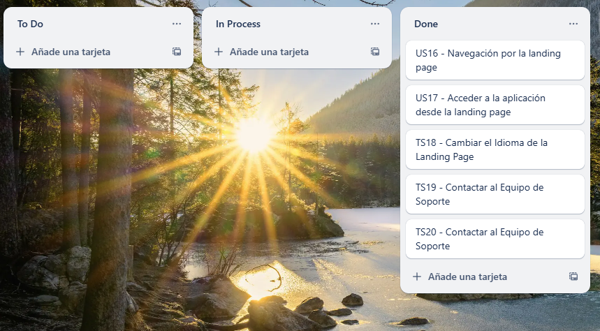

# Final-Report

# Capítulo V: Product Implementation, Validation & Deployment

## 5.1. Software Configuration Management.

En la siguiente sección, detallaremos las herramientas, convenciones, referencias y configuraciones empleadas a lo largo del desarrollo del proyecto, que contribuyeron a mantener la consistencia en el trabajo realizado.

### 5.1.1. Software Development Environment Configuration.

En este apartado, se van a mencionar los distintos productos de software empleados por el equipo de desarrollo, para llevar acabo las actividades relacionadas con la elaboración del proyecto.

**Project Management:**

1. **Discord: https://discord.com/** Aunque originalmente su uso es mas para la comunidad de gamers para comunicarse entre ellos, Discord también se puede utilizar para mejorar la experiencia del usuario a travez de diferentes lugares de comunicación, fijar mensajes, diferentes canales de texto y actividad de los integrantes del grupo.

2. **WhatsApp: https://web.whatsapp.com/** WhatsApp es una aplicación de mensajería instantánea que se utiliza para la comunicación en tiempo real. Aunque no es una herramienta de gestión de proyectos, se puede utilizar para mantener en contacto con los miembros del equipo. 

**Requirements Managemnts:**

1. **Trello: https://trello.com/** Es un software de gestión de proyectos, que facilita asignar y organizar las tareas a realizar. 

**Product UX/UI Design**

1. **Figma: https://www.figma.com/** Figma es una herramienta de edición gráfica, en donde se puede diseñar y prototipar páginas web. Se utilizó para crear los wireframes, mock-ups del proyecto

2. **UXPressia: https://uxpressia.com/** Es una herramienta en línea que permite a los equipos de trabajo identificar y comprender los problemas, necesidades y comportamiento del usuario, lo utilizamos para realizar el Empathy Map, Journey Map, Impact Map

3. **Miro: https://miro.com/es/** Es una plataforma colaborativa el cual permite crear y usar pizarras digitales personalizadas en tiempo real. Lo utilizamos para la creación del As-is y To-Be scenario map.

**Software Development:**

1. **Landing Page:** Para la creación de la landing page, se utilizaron las tecnologias base del desarrollo web: HTML5, CSS3 y JavaScript, Tambien se usó ReactJs y el framework Tailwindcss para facilitar el desarrollo del proyecto.

**Software Documentation:**

1. **GitHub: https://github.com/** GitHub es una plataforma de desarrollo colaborativo que utiliza el sistema de control de versiones Git. Se utiliza para alojar, revisar y colaborar en proyectos de desarrollo de software, lo que facilita la colaboración entre desarrolladores.

2. **LucidChart: https://lucid.app/** LucidChart es una plataforma que cuenta con opciones para la creación de diagramas, mapas mentales, flujos y más, con el uso de plantillas y tableros con edición en tiempo real. Fue utilizado en el desarrollo del diagrama de clases UML

3. **Structurizr: https://www.structurizr.com/** Es una plataforma que permite modelado de diagramas de arquitectura de software por medio de código. Structurizr fue utilizado para crear el modelo C4 de nuestro proyecto.

### 5.1.2. Source Code Management.

El manejo y organización del trabajo se llevaron a cabo mediante una organización en Github Organización: https://github.com/SI730-SW53-OpenSource-Grupo5 Landing Page Repository: https://github.com/SI730-SW53-OpenSource-Grupo5/LandingPage-ConnectionLink.git 

Asimismo, para llevar a cabo un mejor control de cómo crear ramas y realizar cambios en el código fuente, se procedió a utilizar GitFlow.

De este modo, se tenían 2 ramas principales: main y development.

* main: En esta rama almacenaremos las versiones oficiales de nuestro repositorio que ya deben pasar a producción.
* development: Esta rama se utilizará como rama de integración para las “feature” branches. Una vez alcance un estado estable y el equipo lo considere listo para ser lanzado, se unirá a la rama main.
  
**Commit Conventions:**    
El formato de nuestros commits sigue la estructura de los “Conventional Commits” en su versión 1.0.0 (https://www.conventionalcommits.org/en/v1.0.0/) con el objetivo de proporcionar una lectura sencilla de los mismos. Por ello seguimos el siguiente formato: "< type>[optional scope]: < description>" Donde:

* type: Especifica el tipo de cambio realizado, únicamente puede ser feat, fix, update, etc.
* scope: Es el alcance que tiene nuestro commit.
* description: Es un breve resumen de los cambios de código.

### 5.1.3. Source Code Style Guide & Conventions.
En el proyecto hemos hecho uso de algunas convenciones y guia de estilos para el desarrollo del Landing Page.

**React:**

   + Componentes: Se fomenta la creación de componentes para mantener un código limpio y modularizado.
   + Nomenclatura Descriptiva: Utilizamos nombres descriptivos para que se pueda entender cual es su función dentro de la página.
   + Estado y Props: Hacemos uso de los estados y props para pasar datos entre componentes y tener una página reactiva.

**Tailwind CSS:**
   + Clases Utilitarias: Usamos las clases proporcionadas por Tailwind para darle estilos a los elementos de forma eficiente.

**General:**
   + Estructura de Carpetas Organizadas: Mantenemos una estructura de carpetas organizadas para los archivos de React, facilitando así la navegación y entendimiento del proyecto. 

**Git:**
   + Ramas Descriptivas: Utilizamos  nombres de ramas descriptivas para una gestión eficiente del código y las versiones.
   + Flujo de Trabajo Colaborativo: Hacemos uso de ramas para el desarrollo colaborativo.

### 5.1.4. Software Deployment Configuration.

En esta entrega, hemos finalizado nuestra Landing Page y configurado su despliegue de la siguiente manera:

Repositorio GitHub: El código de la Landing Page está alojado en un repositorio específico dentro de nuestra comunidad pública en GitHub.

Vercel: Utilizamos la aplicación Vercel para desplegar la página. Esto nos permite una visualización clara y accesible para los usuarios.

Esta configuración nos brinda un método eficiente y transparente para el despliegue de nuestro proyecto, asegurando una experiencia óptima para nuestros usuarios.

## 5.2. Landing Page, Services & Applications Implementation.

### 5.2.1. Sprint 1

El primer sprint es una etapa importante en nuestro marco de gestión de proyectos de metodología ágil Scrum. En este periodo, agendamos reuniones con el objetivo de conocer mejor las características de cada integrante, y delegamos tareas para materializar el diseño y funcionalidades ya establecidas, para transformarlos en un landing page funcional y que cumple las heurísticas.

#### 5.2.1.1. Sprint Planning 1.

| Sprint 1                   | Implementación de funcionalidades y diseño de la aplicación.                                                                                                                                           |
|----------------------------|--------------------------------------------------------------------------------------------------------------------------------------------------------------------------------------------------------|
| Sprint Planning Background |                                                                                                                                                                                                        |
| Date                       | 10/04/2025                                                                                                                                                                                             |
| Time                       | 20:00                                                                                                                                                                                                  |
| Location                   | Reunión realizada en Discord                                                                                                                                         |
| Prepared By                |                                                                                                  Eddo Su Caletti                                              |
| Attendees                  |  Alexander Paolo Justo Yauricasa, Carlos De La Cruz Villarreal, Miguel Angel Vidal Castro, Fabian Alonso Reyes Trujillano, Ariana Ramirez Carrasco |
| Sprint Goal & User Stories |                                                                                                                                                                                                        |
  | Sprint 1 Goal              | Implementar y desplegar la landing page implica desarrollar una versión funcional basada en los diseños aprobados, integrando elementos clave como formularios, llamados a acción y seguimiento analítico.                                                                                                                                                                |
| Sprint 1 Velocity          |                                                 35               |
| Sum of Story Points        |                                                       30            |

#### 5.2.1.2. Sprint Backlog 1.

| Id   | Title            | Id   | Title                           | Description                                                                           | Estimations (Hours) | Assigned To                       | Status |
|------|------------------|------|---------------------------------|---------------------------------------------------------------------------------------|---------------------|-----------------------------------|--------|
| US16  | Navegación por la landing page     | US16  | Desarrollo del navegación por el Landing Page	 | Como visitante Quiero navegar por la landing page del software Para obtener la información que deseo del producto.	 | 5           |      | Done   |
| US17 | Acceder a la aplicación desde la landing page | US17  | Desarrollo del acceder a la aplicación desde la landing page       | Como visitante de la página Quiero poder acceder a la aplicación desde la landing page Para empezar a usarla.	                 | 6                   |  | Done   |
| TS18 | Cambiar el Idioma de la Landing Page | TS18  | Desarrollo del cambiar el Idioma de la Landing Page       | Como visitante de la página Quiero poder acceder a la aplicación desde la landing page Para empezar a usarla.	       | 5                   |  | Done   |
| TS19 | Contactar al Equipo de Soporte          | TS19  | Desarrollo del Contactar al Equipo de Soporte	      | Como visitante Quiero contactar al equipo de soporte Para obtener ayuda o resolver dudas sobre la plataforma.	      | 7                   |   | Done   |
| TS20 | Contactar al Equipo de Soporte           | TS20  | Desarrollo del Contactar al Equipo de Soporte      | Como desarrollador Quiero corregir los errores del software notificados por el equipo de QA Para mejorar la calidad del producto.	       | 7                   |   | Done   |

   
Link del trello: https://trello.com/b/E7ZyFdYk/vitameet

#### 5.2.1.3. Development Evidence for Sprint Review.

| Repository                 | Branch                   | Commit ID | Commit Message                                                                      | Commit Message Body | Commited On(Date) |
|----------------------------|--------------------------|-----------|-------------------------------------------------------------------------------------|---------------------|-------------------|
| Landing-Page | feature/start           |  6e1825098a9bb126828c89d3b7cd97a21aa0c9db  | feat: add files                                                                   | -                   | 27/04/2025        |
| Landing-Page | feature/animation          |  dbbde2c86106f3706e411b2abe7d1aa9cd727370  | feat(animation): group commit, added animations                                                                  | -                   | 27/04/2025        |
| Landing-Page | feature/colors           |  6caee6df6b32fe8659ac33c75f0c31341ff4e19a  | Add files via upload                                                                | -                   | 27/04/2025        |
| Landing-Page | feature/landing |  c31a8045ab6c04ce81b33465eb0802358323cda2  | feat: add landing                | -                   | 27/04/2025        |
| Landing-Page | feature/login    |  e09522ac580d84b9f1be39fbdb172e1b33a1ebc5  | feat:add login landing page Styles    Add images login| -                   | 27/04/2025        |
| Landing-Page | feature/     |    |  | -                   | 27/04/2025        |

#### 5.2.1.4. Testing Suite Evidence for Sprint Review.

| Repository          | Branch | Commit ID                                | Commit Message                     | Commit Message (Body) | Committed on (Date) |
|---------------------|--------|------------------------------------------|------------------------------------|-----------------------|---------------------|
| Acceptance-Test     | main   | c31a8045ab6c04ce81b33465eb0802358323cda2 | Initial commit                     | -                     | 13/04/2025          |
| Acceptance-Test     | main   | 6e1825098a9bb126828c89d3b7cd97a21aa0c9db | feat: Added us-16 acceptance test  | -                     | 27/04/2025          |
| Acceptance-Test     | main   | dbbde2c86106f3706e411b2abe7d1aa9cd727370 | feat: Added us-17 acceptance test  | -                     | 27/04/2025          |
| Acceptance-Test     | main   | 6caee6df6b32fe8659ac33c75f0c31341ff4e19a | feat: Added us-18 acceptance test  | -                     | 27/04/2025          |
| Acceptance-Test     | main   | e09522ac580d84b9f1be39fbdb172e1b33a1ebc5 | feat: Added us-19 acceptance test  | -                     | 27/04/2025          |
| Acceptance-Test     | main   | cd8cc231ff1973cbffd9adec1839191a5d98ea62 | feat: Added us-20 acceptance test  | -                     | 27/04/2025          |

#### 5.2.1.5. Execution Evidence for Sprint Review.

 

**Enlace a la página:** 

#### 5.2.1.6. Services Documentation Evidence for Sprint Review.

En este sprint 1, los miembros del equipo lograron completar satisfactoriamente todas las tareas propuestas. Este sprint estuvo enfocado principalmente en el desarrollo del landing pague. A lo largo del desarrollo, se realizaron múltiples correcciones a errores presentes en el código, lo que permitió mejorar.
- En el mundo de la programación una landing page es esencial para convertir visitantes en clientes, ya que está diseñada estratégicamente para guiar al usuario hacia una acción específica (como comprar, registrarse o descargar). A diferencia de un sitio web general, enfoca todo el contenido en un único objetivo, eliminando distracciones y optimizando la experiencia del usuario. Con elementos clave como un titular persuasivo, beneficios claros, testimonios y un llamado a la acción (CTA) destacado, aumenta significativamente las tasas de conversión y el retorno de inversión (ROI) de campañas de marketing.

#### 5.2.1.7. Software Deployment Evidence for Sprint Review.

Para este sprint presentado de la landing page se optó por varias herramientas para su desarrollo y despliegue en la web de manera pública.

* Git: Se utilizó para el control de versiones del código fuente.
* GitHub: Se utilizó para crear el repositorio de la landing page, donde se subió el código fuente.

#### 5.2.1.8. Team Collaboration Insights during Sprint.

Para documentar los avances de este Sprint, utilizamos GitHub. Uno de los integrantes del equipo configuró el repositorio inicial, generando múltiples ramas que permitieron trabajar en paralelo sin afectar el progreso de los demás. Clonamos el repositorio localmente con Git, implementamos los cambios necesarios y los subimos a GitHub. Al finalizar, registramos todas las modificaciones, las cuales quedarán disponibles en el repositorio para su revisión.

  

 

### 5.2.2. Sprint 2
#### 5.2.2.1. Sprint Planning 2

| Sprint 2                   | Correción de errores de la landing page e implementación  del frontend y fake API de la web application                                                                                                |
|----------------------------|--------------------------------------------------------------------------------------------------------------------------------------------------------------------------------------------------------|
| Sprint Planning Background |                                                                                                                                                                                                        |
| Date                       | 12/05/2025                                                                                                                                                                                             |
| Time                       | 16:00                                                                                                                                                                                                  |
| Location                   | Reunión realizada mediante Discord                                                                                                                                                                     |
| Prepared By                | Esteban Garcia, Nicolas Sebastian                                                                                                                                                                      |
| Attendees                  | Carlos Alejandro De La Cruz Villarreal, Alexander Paolo Justo Yauricasa, Ariana Lizeth Ramirez Carrasc,Fabian Alonso Reyes Trujillano,Miguel Angel Vidal Castro	 |
| Sprint Goal & User Stories |                                                                                                                                                                                                        |
| Sprint 2 Goal              | Elaboracion de un frontend de una citas de medicas                                                                                                                                                                 |
| Sprint 2 Velocity          | 45                                                                                                                                                                                                     |
| Sum of Story Points        | 41                                                                                                                                                                                                     |

#### 5.2.2.2 Sprint Backlog 2

| User Story |  | Work-Item/Task |  |  |  |  |
|------------|----------------|-------------|--------------------------------|-----------|------------------|--------|
| ID         | Title          | ID          | Title                          | Description                     | Estimation | Assigned To      | Status |
| US01       | Registrar usuario	 	 | W201       | Crear el componente de hilo  | Creación del componente que permita visualizar informacion mas especifica de cada hilo e implementacion del service y model. | 5 horas | Eddo  | Done   |
| US04       | Historial del paciente	 	 | W202     | Crear el componente de calendario  | Creación de componentes que permiten visualizar el calendario con los eventos a los que asistira un usuario o specialista e implementacion del service y model. | 5 horas | Fabian  | Done   |
| US09	       | Filtrar búsqueda de médicos	 	 | W203     | Crear el componente de cita | Creación del componente que permite agendar una cita privada en el perfil del especialista, e implementacion del service y model. | 5 horas | Miguel  | Done   |
| US12       | Calificar médico	 	 | W204        | Crear el componente de suscripcion | Creacion del componente que permite a los usuarios pagar una suscripcion. | 5 horas | Alexander | Done   |
| US16      | Ver mi perfil	 	 | W205        | Crear el componente de mensajeria | Creacion del componente que permite visualizar todas las conversaciones de un usuario o un especialista, implementacion de model y service.| 3 horas | Miguel  | Done   |
| US17       | Traducir idioma	 	 | W206       | Crear el componente de listado de hilos | Creacion del componente para visualizar hilos en el foro e implementacion de model y service. | 5 horas | Ariana  | Done   |
| US18       | Actualizar correo electrónico		 | W207        | Crear el componente de perfil de especialista | Creacion del componente que permite visualizar el perfil de un especialista e implementación de model y service. | 5 horas | Carlos  | Done   |

#### 5.2.2.3. Development Evidence for Sprint Review.

| Repository              | Branch                     | Commit ID | Commit Message                                                 | Commit Message Body | Commited On(Date) |
|-------------------------|----------------------------|-----------|----------------------------------------------------------------|---------------------|-------------------|
| Frontend | feature/calendar           | 9f3f1e1   | feat: calendar component added                                 | -                   | 15/05/2025        |
| Frontend | feature/events             | 1bba0a4   | update: responsive event component                             | -                   | 15/05/2025        |
| Frontend | feature/payment            | cf72c8b   | Add files via upload                                           | -                   | 15/05/2025        |
| Frontend | feature/analytics          | cea366a   | feat: analytics component added without data                   | -                   | 15/05/2025        |
| Frontend | feature/specialist-profile | 6160b9e   | feat: add extra configurations                                 | -                   | 15/05/2025        |
| Frontend | feature/home               | 50e024c   | Update home                                                    | -                   | 15/05/2025        |
| Frontend | feature/forums             | 7add9b1   | feat: refresh button clean inputs and add styles to containers | -                   | 15/05/2025        |
| Frontend | feature/specialist-inbox   | ed2da55   | feature(inbox)                                                 | -                   | 15/05/2025        |

#### 5.2.2.5. Execution Evidence for Sprint Review.

 

#### 5.2.2.6. Services Documentation Evidence for Sprint Review

- En el mundo de la programación y el desarrollo web, los endpoints juegan un papel crucial en la comunicación entre el cliente y el servidor. Imagina un endpoint como un punto de entrada específico en una aplicación o servicio web, similar a una puerta de acceso en un edificio con múltiples habitaciones. Cada endpoint está asociado con una ruta única, que generalmente se expresa como una URL. Cuando un cliente, como un navegador web o una aplicación móvil, envía una solicitud a un servidor, especifica el endpoint al que desea acceder. El servidor, a su vez, procesa esa solicitud y responde con la información o la acción correspondiente. Los endpoints actúan como controladores de tráfico, dirigiendo y gestionando las solicitudes de los usuarios hacia las partes relevantes de la aplicación. Cada endpoint puede ofrecer diferentes funcionalidades, desde mostrar información estática hasta realizar operaciones complejas en la base de datos. Al definir y documentar endpoints, los desarrolladores proporcionan una guía clara sobre cómo interactuar con su aplicación. Esto facilita a otros desarrolladores entender cómo integrar su aplicación en la suya, así como a los usuarios comprender qué acciones pueden realizar y cómo hacerlo.
  
| Endpoint   | Detalles                                                                                     |
|------------|----------------------------------------------------------------------------------------------|
| /home      | En esta ruta se muestra la primera vista del servicio.                                       |
| /forums    | En esta ruta se muestran los foros donde los usuarios pueden discutir diversos temas.        |
| /event     | En esta ruta se muestran detalles específicos sobre un evento en particular.                 |
| /perfil    | En esta ruta se muestran detalles del perfil.                                                |

#### 5.2.2.7. Software Deployment Evidence for Sprint Review.

Para el sprint presentado de la landing page se optó por varias herramientas para su desarrollo y despliegue en la web de manera pública.

* Git: Se utilizó para el control de versiones del código fuente.
* GitFlow: Se utilizó para ver el avance de los integrantes del equipo.
* GitHub: Se utilizó para crear el repositorio de la landing page, donde se subió el código fuente.
* Vercel: Se utilizó esta herramienta ya que nos ofrece un despliegue sin costo de manera rápida y fácil, además que se puede vincular directamente con el repositorio de GitHub.
* Angular Material: Libreria de Angular que funciona como una cpaa frontend para desarrollar aplicaciones de una manera rapida, flexible y de fácil implementación. Contiene una gran variedad de componentes de interfaz de usuario lo que ayuda a diseñar una aplicación mas estructurada https://material.angular.io/
* Angular: Es un framework para aplicaciones web basado en Typesrcipt, de codigo abierto, actualmente mantenido por Google, que se utiliza para crear aplicaciones web se una sola pagina como enfoque principal (SPA), para este caso utilizamos la version Angular 17, la ultima version, la cual trabaja con standalones. https://angular.io/
* Webstorm: Es un entorno de desarrollo que nos permitirá trabajar con Javascript / Typescript y desarrollar la aplicacion web. https://www.jetbrains.com/es-es/webstorm/learn/

#### 5.2.2.8. Team Collaboration Insights during Sprint.

Para llevar a cabo los registros de nuestros avances durante el primer Sprint de desarrollo, empleamos GitHub. Un miembro del equipo inició el proceso con un primer registro para establecer el repositorio y creó muchas ramas para poder trabajar sin interrumpir el avance de otro compañero. Posteriormente, hicimos una copia local del repositorio mediante Git, realizamos las modificaciones en GitHub. Finalmente, completamos el proceso con un registro de los cambios, el cual será examinado en el repositorio de GitHub.

* A través de GitHub es donde se registran problemas. La sección de "Issues" en GitHub sirve como un tablero virtual donde los colaboradores registran problemas, errores o mejoras que necesitan ser abordados en un proyecto web. Estas entradas proporcionan una manera estructurada de organizar y priorizar el trabajo, facilitando la comunicación entre los miembros del equipo. 
### 5.2.3. Sprint 3
#### 5.2.3.1. Sprint Planning 3

| Sprint 3                   | Correción de errores del frotend e implementación  del parte del backend                                                                                                |
|----------------------------|--------------------------------------------------------------------------------------------------------------------------------------------------------------------------------------------------------|
| Sprint Planning Background |                                                                                                                                                                                                        |
| Date                       | 18/06/2025                                                                                                                                                                                             |
| Time                       | 14:00                                                                                                                                                                                                  |
| Location                   | Reunión realizada mediante Discord                                                                                                                                                                     |
| Prepared By                | Esteban Garcia, Nicolas Sebastian                                                                                                                                                                      |
| Attendees                  | Alexander Paolo Justo Yauricasa, Ariana Lizeth Ramirez Carrasc,Fabian Alonso Reyes Trujillano,Miguel Angel Vidal Castro	 |
| Sprint Goal & User Stories |                                                                                                                                                                                                        |
| Sprint 2 Goal              | Completar el frontend y realizar parte del backend (Funciones principales)                                                                                                                                                                  |
| Sprint 2 Velocity          | 10                                                                                                                                                                                                     |
| Sum of Story Points        | 10                                                                                                                                                                                                     |

#### 5.2.3.2 Sprint Backlog 3

| User Story |  | Work-Item/Task |  |  |  |  |
|------------|----------------|-------------|--------------------------------|-----------|------------------|--------|
| ID         | Title          | ID          | Title                          | Description                     | Estimation | Assigned To      | Status |
| US2       | Configuración Inicial del Servidor | W213a | Preparar el entorno del servidor | Preparación del entorno del servidor con las herramientas y software necesarios. | 1 hora  | Djalma Dioses | Done   |
| US2       | Configuración Inicial del Servidor | W213b | Configurar parámetros del servidor | Establecimiento de parámetros de configuración del servidor para optimización del rendimiento. | 1 hora  | Djalma Dioses Santos | Done   |
| US3     | Autenticación y Seguridad Básica | W216a | Configurar protocolos de seguridad | Configuración de protocolos de seguridad como SSL/TLS para la protección de datos en tránsito. | 2 horas | Johan Principe Godoy | Done   |
| US3       | Autenticación y Seguridad Básica | W216b | Implementar sistema de autenticación | Desarrollo e implementación de un sistema de autenticación basado en tokens o sesiones. | 2 horas | Johan Principe Godoy | Done   |
| US3       | Autenticación y Seguridad Básica | W216c | Testear seguridad y autenticación | Realización de pruebas para validar la seguridad y la efectividad de la autenticación. | 1 hora  | Braulio Torrejon Navarro | Done   |
| US4       | Configuración de Logging y Monitoreo | W217a | Instalar herramientas de logging | Instalación y configuración de herramientas para el logging de actividades del sistema. | 1 hora  | Braulio Torrejon Navarro | Done   |
| US4       | Configuración de Logging y Monitoreo | W217b | Configurar monitoreo del sistema | Configuración de herramientas de monitoreo para supervisar el rendimiento y la estabilidad del sistema. | 1 hora  | Braulio Torrejon Navarro | Done   |
| US4       | Configuración de Logging y Monitoreo | W217c | Crear dashboards de monitoreo | Creación de dashboards para visualizar en tiempo real la información de logging y monitoreo. | 1 hora  | Nicolas Esteban Garcia | Done   |

#### 5.2.3.3. Development Evidence for Sprint Review.

| Repository              | Branch                     | Commit ID | Commit Message                                                 | Commit Message Body | Commited On(Date) |
|-------------------------|----------------------------|-----------|----------------------------------------------------------------|---------------------|-------------------|
| Backend | feature/evaluation          | 00b56ed | add ecaluation                                | -                   | 15/06/2025        |
| Backend | feature/gestionar-agenda             | 47dabcc   | add agenda                            | -                   | 15/06/2025        |
| Backend | feature/gestionar-citas            | 47dabcc | Add dates                                          | -                   | 15/06/2025        |
| Backend | feature/login          | 47dabcc   | feat: add login                 | -                   | 15/06/2025        |
| Backend | feature/reguister | 47dabcc   | feat: add reguister                                | -                   | 15/06/2025        |

#### 5.2.3.5. Execution Evidence for Sprint Review.

Para el sprint 3 se ha presentado el back-end y se optó por varias herramientas para su desarrollo:

- *Git*: Se utilizó para el control de versiones del código fuente.
- *GitFlow*: Se utilizó para ver el avance de los integrantes del equipo.
- *GitHub*: Se utilizó para crear el repositorio del back-end, donde se subió el código fuente.
- *Swagger*: Se utilizó para documentar la API RESTful.
- *MySQL*: Se utilizó para la base de datos.

#### 5.2.3.6. Services Documentation Evidence for Sprint Review

- En el mundo de la programación y el desarrollo web, los endpoints juegan un papel crucial en la comunicación entre el cliente y el servidor. Imagina un endpoint como un punto de entrada específico en una aplicación o servicio web, similar a una puerta de acceso en un edificio con múltiples habitaciones. Cada endpoint está asociado con una ruta única, que generalmente se expresa como una URL. Cuando un cliente, como un navegador web o una aplicación móvil, envía una solicitud a un servidor, especifica el endpoint al que desea acceder. El servidor, a su vez, procesa esa solicitud y responde con la información o la acción correspondiente. Los endpoints actúan como controladores de tráfico, dirigiendo y gestionando las solicitudes de los usuarios hacia las partes relevantes de la aplicación. Cada endpoint puede ofrecer diferentes funcionalidades, desde mostrar información estática hasta realizar operaciones complejas en la base de datos. Al definir y documentar endpoints, los desarrolladores proporcionan una guía clara sobre cómo interactuar con su aplicación. Esto facilita a otros desarrolladores entender cómo integrar su aplicación en la suya, así como a los usuarios comprender qué acciones pueden realizar y cómo hacerlo.
  
| Endpoint   | Detalles                                                                                     |
|------------|----------------------------------------------------------------------------------------------|
| /evaluation      | En esta ruta se gestionan las evaluaciones de las citas.                                       |
| /gestion-agenda    | En esta ruta se gestionan la agendas de los medicos.        |
| /gestion-citas     | En esta ruta se gestionan las citas realizadas por los clientes.                 |
| /loguin   | En esta ruta se gestionan los ajustes del loguin.                                                |

#### 5.2.3.7. Software Deployment Evidence for Sprint Review.

Para el sprint presentado del Banck-end se optó por varias herramientas para su desarrollo y despliegue de manera pública.

* Git: Se utilizó para el control de versiones del código fuente.
* GitFlow: Se utilizó para ver el avance de los integrantes del equipo.
* GitHub: Se utilizó para crear el repositorio del backend, donde se subió el código fuente.
* Azure: Se utilizó esta herramienta ya que nos ofrece un despliegue rápido de una maquiva virtual.
* Intellij: Se utilizó esta herramienta de programacion para codificar cada content realizado en el trabajo.
* Spring: Se utilizó esta framework para generar una base para el back del proyecto.
* Swagger: Se utilizó esta herramienta para la documentacion de nuestras APIs.

#### 5.2.3.8. Team Collaboration Insights during Sprint.

Durante el Sprint 3, se desarrollaron diversas funcionalidades clave para el backend de la aplicación. Para gestionar esto de manera eficiente, se crearon ramas específicas para cada funcionalidad, permitiendo un desarrollo aislado y organizado. Cada feature fue implementada y confirmada mediante commits individuales antes de ser fusionada con la rama de desarrollo (develop). Posteriormente, se verificó minuciosamente la ausencia de conflictos para asegurar la integridad del código. Una vez confirmada la estabilidad, se realizó la fusión final con la rama de producción (main).

### 5.3 Validation Interviews
#### 5.3.1 Diseño de entrevistas

**Objetivo de la entrevista:**

Validar la usabilidad y efectividad de la landing page de TocaAquí y de los flujos de usuario (user flows) asegurando que cada flujo sea intuitivo, claro y funcional para los usuarios y su interaccion con la plataforma.

#### Saludo y presentación

Comenzamos con una introducción breve de los entrevistados para recordar quiénes son:

1. ¿Cómo se llama?
2. ¿Cuántos años tiene?
3. ¿En qué distrito vive?

#### Preguntas

Estas preguntas nos ayudarán a saber cuál es la experiencia de usuario, si nuestro producto llenó las expectativas del usuario, y también saber las posibles mejoras, comentarios y quejas sobre nuestro producto.

 Preguntas para Médicos
 
1.¿Te resulta fácil y rápido registrar tus horarios de atención en la plataforma?

2.¿Qué tan útil consideras la función de gestión de agenda para organizar tus consultas diarias?

3.¿Has notado una reducción en el ausentismo de tus pacientes desde que usas la plataforma?

4.¿La opción de visualizar el historial médico de cada paciente mejora tu atención?

5.¿Te sientes cómodo utilizando la plataforma desde un celular o prefieres el uso en PC?

6.¿Qué tan confiables consideras las notificaciones y recordatorios que envía el sistema?

7.¿Te gustaría tener funciones adicionales como alertas por paciente frecuente o indicadores de carga de trabajo?

8.¿La plataforma facilita la comunicación con tus pacientes? ¿Cómo podría mejorar?

9.¿Qué tan seguro percibes el manejo de la información médica dentro de VitaMeet?

10.¿Recomendarías esta herramienta a otros colegas? ¿Por qué?

 Preguntas para Pacientes

1.¿Te resultó fácil registrarte y crear tu perfil en la plataforma?

2.¿Cómo calificas la experiencia al buscar y agendar una cita médica?

3.¿Recibiste notificaciones a tiempo sobre tus próximas citas?

4.¿Te ayudó la plataforma a evitar olvidos o ausencias a tus consultas?

5.¿Te parece útil poder ver tu historial de atenciones y diagnósticos anteriores?

6.¿Cómo te sentiste con la interfaz del sitio web? ¿Fue fácil de usar?

7.¿Sientes que esta plataforma te ahorra tiempo en comparación con métodos tradicionales?

8.¿Te gustaría tener acceso a más especialidades médicas o servicios relacionados?

9.¿La experiencia digital te genera confianza respecto a la seguridad de tus datos?

10.¿Recomendarías VitaMeet a amigos o familiares para agendar citas médicas? ¿Por qué?

<h4 id="registryInterviews">5.3.2. Registro de Entrevistas</h4>

<table border="1" cellpadding="8" cellspacing="0">
    <tr><th colspan="2">Entrevista 1</th></tr>
    <tr><td>Segmento Objetivo</td><td>Pacientes - Personas adultas que necesitan atención médica</td></tr>
    <tr><td>Fecha Entrevista</td><td>21/06/2025</td></tr>
    <tr><td>Entrevistador</td><td>Eddo Su Caletti</td></tr>
    <tr><td>Entrevistado</td><td>....</td></tr>
    <tr><td>Edad</td><td>.... años</td></tr>
    <tr><td>Distrito</td><td>Chorrillos </td></tr>
    <tr><td>Link del Video</td><td><a href="link">Ver Video</a></td></tr>
    <tr><td>Minuto de Inicio</td><td>00:00</td></tr>
    <tr><td>Duración</td><td>04:44 minutos</td></tr>
    <tr><td>Imagen</td><td></td></tr>
    <tr><td>Resumen</td><td>El entrevistado ....</td></tr>
</table> 

<table border="1" cellpadding="8" cellspacing="0">
    <tr><th colspan="2">Entrevista 2</th></tr>
    <tr><td>Segmento Objetivo</td><td>Pacientes - Personas adultas que necesitan atención médica</td></tr>
    <tr><td>Fecha Entrevista</td><td>21/06/2025</td></tr>
    <tr><td>Entrevistador</td><td>Alexander Paolo Justo Yauricasa</td></tr>
    <tr><td>Entrevistado</td><td>...</td></tr>
    <tr><td>Edad</td><td>... años</td></tr>
    <tr><td>Distrito</td><td>....</td></tr>
    <tr><td>Link del Video</td><td><a href="link">Ver Video</a></td></tr>
    <tr><td>Minuto de Inicio</td><td>04:45</td></tr>
    <tr><td>Duración</td><td>04:54 minutos</td></tr>
    <tr><td>Imagen</td><td></td></tr>
    <tr><td>Resumen</td><td>El entrevistado .....</td></tr>
</table> 

<table border="1" cellpadding="8" cellspacing="0">
    <tr><th colspan="2">Entrevista 3</th></tr>
    <tr><td>Segmento Objetivo</td><td>Pacientes - Personas adultas que necesitan atención médica</td></tr>
    <tr><td>Fecha Entrevista</td><td>21/06/2025</td></tr>
    <tr><td>Entrevistador</td><td>Eddo Su Caletti</td></tr>
    <tr><td>Entrevistado</td><td>...</td></tr>
    <tr><td>Edad</td><td>... años</td></tr>
    <tr><td>Distrito</td><td>....</td></tr>
    <tr><td>Link del Video</td><td><a href="link">Ver Video</a></td></tr>
    <tr><td>Minuto de Inicio</td><td>09:38</td></tr>
    <tr><td>Duración</td><td>04:59 minutos</td></tr>
    <tr><td>Imagen</td><td></td></tr>
    <tr><td>Resumen</td><td>El entrevistado, ...</td></tr>
</table> 

<table border="1" cellpadding="8" cellspacing="0">
    <tr><th colspan="2">Entrevista 4</th></tr>
    <tr><td>Segmento Objetivo</td><td>Médicos - Generales y especialistas con experiencia</td></tr>
    <tr><td>Fecha Entrevista</td><td>21/06/2025</td></tr>
    <tr><td>Entrevistador</td><td>Ariana Lizeth Ramirez Carrasco</td></tr>
    <tr><td>Entrevistado</td><td>Billy Ruiz Madrid</td></tr>
    <tr><td>Edad</td><td>26 años</td></tr>
    <tr><td>Distrito</td><td>Chorrillos </td></tr>
    <tr><td>Link del Video</td><td><a href="link">Ver Video</a></td></tr>
    <tr><td>Minuto de Inicio</td><td>14:38</td></tr>
    <tr><td>Duración</td><td>03:40 minutos</td></tr>
    <tr><td>Imagen</td><td></td></tr>
    <tr><td>Resumen</td><td>El entrevistado, brindó retroalimentación positiva respecto al uso del frontend de VitaMeet. Mencionó que registrar sus horarios de atención fue un proceso fácil y rápido, destacando la claridad del formulario y la posibilidad de establecer rangos específicos sin complicaciones. Sobre la gestión de agenda, consideró que la herramienta es muy útil para organizar sus consultas diarias, ya que le permite visualizar su jornada médica con orden y anticipación. Asimismo, indicó que ha notado una ligera reducción en el ausentismo de pacientes desde que utiliza la plataforma, lo cual atribuye a los recordatorios automáticos. Respecto al historial médico, comentó que poder visualizar la información clínica de cada paciente mejora significativamente la calidad de atención, ya que puede conocer antecedentes antes de cada consulta.</td></tr>
</table> 

<table border="1" cellpadding="8" cellspacing="0">
    <tr><th colspan="2">Entrevista 5</th></tr>
    <tr><td>Segmento Objetivo</td><td>Médicos - Generales y especialistas con experiencia</td></tr>
    <tr><td>Fecha Entrevista</td><td>00/06/2025</td></tr>
    <tr><td>Entrevistador</td><td>...</td></tr>
    <tr><td>Entrevistado</td><td>...</td></tr>
    <tr><td>Edad</td><td>... años</td></tr>
    <tr><td>Distrito</td><td>....</td></tr>
    <tr><td>Link del Video</td><td><a href="link">Ver Video</a></td></tr>
    <tr><td>Minuto de Inicio</td><td>00:01</td></tr>
    <tr><td>Duración</td><td>08:52 minutos</td></tr>
    <tr><td>Imagen</td><td></td></tr>
    <tr><td>Resumen</td><td>El entrevistado .....</td></tr>
</table> 

<h4 id="heuristicEvaluation">5.3.3. Evaluaciones según heurísticas</h4>

    <h2>UX Heuristics & Principles Evaluation</h2>
    <h3>Usability – Inclusive Design – Information Architecture</h3>

<strong>CARRERA:</strong> Ingeniería de Software

<strong>CURSO:</strong> Desarrollo de Aplicaciones Open Source

<strong>SECCIÓN:</strong> 4313

<strong>PROFESORES:</strong> Alberto Wilmer Sanchez Seña

<strong>AUDITOR:</strong> MetaDevs

<strong>CLIENTE(S):</strong> Alexander Paolo Justo Yauricasa - Ariana Lizeth Ramirez Carrasco - Fabian Alonso Reyes Trujillano - Eddo Su Caletti - Miguel Angel Vidal Castro.

 

<strong>SITE O APP A EVALUAR:</strong>

Landing Page & Web Application of VitaMeet

 

<strong>TAREAS A EVALUAR:</strong>

El alcance de esta evaluación incluye la revisión de las siguientes tareas:

<ol>
    <li>Evaluar si el propósito de <strong>VitaMeet</strong> se entiende claramente con solo ver la página</li>
    <li>Revisar la claridad de los mensajes, secciones y <em>Call-to-Actions</em></li>
    <li>Comprobar si el diseño transmite confianza y profesionalismo</li>
    <li>Validar si la información presentada resulta atractiva y relevante para posibles usuarios</li>
    <li>Agendar una nueva cita médica</li>
    <li>Visualizar el historial clínico</li>
    <li>Gestionar citas médicas (reprogramar/cancelar)</li>
</ol>

 

No están incluidas en esta versión de la evaluación las siguientes tareas:

<ol>
    <li>Registrar una nueva cuenta</li>
    <li>Búsqueda de médicos por especialidad, distrito y disponibilidad detallada.</li>
    <li>Envío de recordatorios automáticos (WhatsApp, correo, SMS)</li>
    <li>Sistema de calificaciones y reseñas de médicos</li>

</ol>

 

<strong>ESCALA DE SEVERIDAD:</strong>

Los errores serán puntuados tomando en cuenta la siguiente escala de severidad

<table>
    <tr>
        <th style="border: 1px solid #dddddd; padding: 8px; text-align: center;">Nivel</th>
        <th style="border: 1px solid #dddddd; padding: 8px; text-align: center;">Descripción</th>
    </tr>
    <tr>
        <td style="border: 1px solid #dddddd; padding: 8px; text-align: center;">1</td>
        <td style="border: 1px solid #dddddd; padding: 8px; text-align: justify;">Problema superficial: puede ser fácilmente superador por el usuario ó ocurre con muy poco frecuencia. No necesita ser arreglado a no ser que exista disponibilidad de tiempo.</td>
    </tr>
    <tr>
        <td style="border: 1px solid #dddddd; padding: 8px; text-align: center;">2</td>
        <td style="border: 1px solid #dddddd; padding: 8px; text-align: justify;">Problema menor: puede ocurrir un poco más frecuentemente o es un poco más difícil de superar para el usuario. Se le debería asignar una prioridad baja resolverlo de cara al siguiente reléase</td>
    </tr>
    <tr>
        <td style="border: 1px solid #dddddd; padding: 8px; text-align: center;">3</td>
        <td style="border: 1px solid #dddddd; padding: 8px; text-align: justify;">Problema mayor: ocurre frecuentemente o los usuarios no son capaces de resolverlos. Es importante que sean corregidos y se les debe asignar una prioridad alta.</td>
    </tr>
    <tr>
        <td style="border: 1px solid #dddddd; padding: 8px; text-align: center;">4</td>
        <td style="border: 1px solid #dddddd; padding: 8px; text-align: justify;">Problema muy grave: un error de gran impacto que impide al usuario continuar con el uso dela herramienta. Es imperativo que sea corregido antes del lanzamiento.</td>
    </tr>
</table>

 

<strong>TABLA RESUMEN:</strong>

 

<table>
    <tr>
        <th style="border: 1px solid #dddddd; padding: 8px; text-align: center;">#</th>
        <th style="border: 1px solid #dddddd; padding: 8px; text-align: center;">Problema</th>
        <th style="border: 1px solid #dddddd; padding: 8px; text-align: center;">Escala de severidad</th>
        <th style="border: 1px solid #dddddd; padding: 8px; text-align: center;">Heurística/Principio violada(o)</th>
    </tr>
    <tr>
        <td style="border: 1px solid #dddddd; padding: 8px; text-align: center;">1</td>
        <td style="border: 1px solid #dddddd; padding: 8px; text-align: justify;">La información del historial médico se muestra duplicada para el mismo paciente.</td>
        <td style="border: 1px solid #dddddd; padding: 8px; text-align: center;">3</td>
        <td style="border: 1px solid #dddddd; padding: 8px; text-align: justify;">Usability: Consistency and Standards - <strong>Are there clear internal and external consistencies?</strong></td>
    </tr>
    <tr>
        <td style="border: 1px solid #dddddd; padding: 8px; text-align: center;">2</td>
        <td style="border: 1px solid #dddddd; padding: 8px; text-align: justify;">Falta de un indicador visual claro para el estado de la cita (confirmada, pendiente, etc.) en la gestión de citas médicas.</td>
        <td style="border: 1px solid #dddddd; padding: 8px; text-align: center;">2</td>
        <td style="border: 1px solid #dddddd; padding: 8px; text-align: justify;">Usability: Visibility of System Status - <strong>Does the website keep users informed about what is going on?</strong></td>
    </tr>
    <tr>
        <td style="border: 1px solid #dddddd; padding: 8px; text-align: center;">3</td>
        <td style="border: 1px solid #dddddd; padding: 8px; text-align: justify;">No hay un mensaje de confirmación claro después de confirmar una cita, lo que puede generar incertidumbre en el usuario.</td>
        <td style="border: 1px solid #dddddd; padding: 8px; text-align: center;">2</td>
        <td style="border: 1px solid #dddddd; padding: 8px; text-align: justify;">Usability: Visibility of System Status - <strong>Does the website keep users informed about what is going on?</strong></td>
    </tr>
    <tr>
        <td style="border: 1px solid #dddddd; padding: 8px; text-align: center;">4</td>
        <td style="border: 1px solid #dddddd; padding: 8px; text-align: justify;">La funcionalidad de "Buscar doctor" en el agendamiento de citas no parece tener una indicación visual de filtro o búsqueda activa.</td>
        <td style="border: 1px solid #dddddd; padding: 8px; text-align: center;">1</td>
        <td style="border: 1px solid #dddddd; padding: 8px; text-align: justify;">Usability: Recognition rather than recall - <strong>Is information easily recognizable or do users have to recall information?</strong></td>
    </tr>
    <tr>
        <td style="border: 1px solid #dddddd; padding: 8px; text-align: center;">5</td>
        <td style="border: 1px solid #dddddd; padding: 8px; text-align: justify;">La gestión de citas médicas muestra fechas con años anteriores al actual (2030-06-14), lo cual es incongruente con citas activas.</td>
        <td style="border: 1px solid #dddddd; padding: 8px; text-align: center;">3</td>
        <td style="border: 1px solid #dddddd; padding: 8px; text-align: justify;">Usability: Match between system and the real world - <strong>Is the system clear and easy to understand?</strong></td>
    </tr>
    <tr>
        <td style="border: 1px solid #dddddd; padding: 8px; text-align: center;">6</td>
        <td style="border: 1px solid #dddddd; padding: 8px; text-align: justify;">No hay un sistema de paginación o búsqueda en el historial médico, lo que podría dificultar la navegación para usuarios con muchas entradas.</td>
        <td style="border: 1px solid #dddddd; padding: 8px; text-align: center;">2</td>
        <td style="border: 1px solid #dddddd; padding: 8px; text-align: justify;">Information Architecture: <strong>Is it accessible?</strong></td>
    </tr>
</table>

 

<strong>DESCRIPCIÓN DE PROBLEMAS:</strong>

<strong>Problema #1:</strong> La información del historial médico se muestra duplicada para el mismo paciente.

<strong>Severidad:</strong> 3

<strong>Heurística/Principio violada(o):</strong> Usability: Consistency and Standards - <strong>Are there clear internal and external consistencies?</strong>

<strong>Problema:</strong>

En la sección de "Historial Médico", se observa que la información de "Nombre: María García" se repite exactamente dos veces con los mismos datos (Edad, Teléfono, Dirección, Diagnóstico, Tratamiento, Fecha). Esto genera redundancia y una mala experiencia de usuario, haciendo que el historial parezca desorganizado o incorrecto.

    

 

<strong>Recomendación:</strong>

Implementar una lógica para evitar la duplicación de registros de historial médico. Cada entrada debería ser única, posiblemente agrupando por paciente y mostrando un listado cronológico de sus citas, diagnósticos y tratamientos. Si se trata de citas distintas del mismo paciente, deben tener detalles que las diferencien claramente (por ejemplo, fecha y hora de la cita específica).

 

<strong>Problema #2:</strong> Falta de un indicador visual claro para el estado de la cita (confirmada, pendiente, etc.) en la gestión de citas médicas.

<strong>Severidad:</strong> 2

<strong>Heurística/Principio violada(o):</strong> Usability: Visibility of System Status - <strong>Does the website keep users informed about what is going on?</strong>

<strong>Problema:</strong>

En la sección "Gestión de Citas Médicas", todas las citas se muestran de la misma manera, con los botones "Reprogramar" y "Cancelar". No hay un indicador visual que diferencie si una cita está confirmada, pendiente, completada o si ha sido cancelada o reprogramada previamente. Esto puede generar confusión sobre el estado actual de las citas.

    

 

<strong>Recomendación:</strong>

Añadir un "tag" o etiqueta visual al lado de cada cita que indique su estado actual (ej. "Confirmada", "Pendiente", "Completada", "Cancelada"). También se podría cambiar la apariencia de los botones "Reprogramar" y "Cancelar" (deshabilitarlos o cambiarlos de color) según el estado de la cita, por ejemplo, si ya fue completada.

 

<strong>Problema #3:</strong> No hay un mensaje de confirmación claro después de confirmar una cita, lo que puede generar incertidumbre en el usuario.

<strong>Severidad:</strong> 2

<strong>Heurística/Principio violada(o):</strong> Usability: Visibility of System Status - <strong>Does the website keep users informed about what is going on?</strong>

<strong>Problema:</strong>

Una vez que el usuario hace clic en "Confirmar cita", la imagen no muestra qué sucede a continuación. Es crucial que el sistema proporcione una retroalimentación clara de que la cita ha sido agendada con éxito, o si hubo algún problema. La falta de este mensaje puede dejar al usuario dudando si su acción fue procesada correctamente.

    

 

<strong>Recomendación:</strong>

Al confirmar la cita, mostrar un mensaje de éxito prominente (ej. un banner verde o un modal flotante) que diga "¡Cita confirmada con éxito!" e idealmente, redirigir al usuario a la sección de "Gestión de Citas Médicas" donde pueda ver su nueva cita listada. También se podría ofrecer la opción de agregar la cita al calendario personal.

 

<strong>Problema #4:</strong> La funcionalidad de "Buscar doctor" en el agendamiento de citas no parece tener una indicación visual de filtro o búsqueda activa.

<strong>Severidad:</strong> 1

<strong>Heurística/Principio violada(o):</strong> Usability: Recognition rather than recall - <strong>Is information easily recognizable or do users have to recall information?</strong>

<strong>Problema:</strong>

En la sección de "Doctores", hay un campo "Buscar doctor...". Aunque la funcionalidad de búsqueda es útil, no hay un botón de "buscar" explícito o un indicador de que al escribir se filtrarán los resultados, lo que podría no ser intuitivo para todos los usuarios. No se visualiza si el campo es de autocompletado o si requiere una acción posterior para activar la búsqueda.

    

 

<strong>Recomendación:</strong>

Añadir un icono de lupa dentro o al lado del campo de búsqueda para indicar su función. Si la búsqueda es instantánea, indicarlo con un texto pequeño como "Filtra por nombre..." o si requiere presionar Enter o un botón, hacer ese botón explícito. Esto mejora la detectabilidad de la funcionalidad.

 

<strong>Problema #5:</strong> La gestión de citas médicas muestra fechas con años anteriores al actual (2030-06-14), lo cual es incongruente con citas activas.

<strong>Severidad:</strong> 3

<strong>Heurística/Principio violada(o):</strong> Usability: Match between system and the real world - <strong>Is the system clear and easy to understand?</strong>

<strong>Problema:</strong>

En la sección "Gestión de Citas Médicas", se observa una cita con la fecha "2030-06-14". Si bien podría ser una cita futura, dado el contexto de citas "activas" para gestionar, una fecha tan lejana en el futuro puede ser un error de dato o un placeholder que no corresponde a la realidad, lo que confunde al usuario sobre la validez de las citas mostradas.

    

 

<strong>Recomendación:</strong>

Verificar la lógica de visualización y filtrado de citas para asegurar que solo se muestren citas relevantes (ej. futuras o pasadas recientes). Si el año "2030" es un error, corregirlo en la base de datos o en la lógica de generación de datos. Asegurar que las fechas reflejen con precisión cuándo la cita está programada en relación con el "ahora" para el usuario.

 

<strong>Problema #6:</strong> No hay un sistema de paginación o búsqueda en el historial médico, lo que podría dificultar la navegación para usuarios con muchas entradas.

<strong>Severidad:</strong> 2

<strong>Heurística/Principio violada(o):</strong> Information Architecture: <strong>Is it accessible?</strong>

<strong>Problema:</strong>

La sección "Historial Médico" muestra una lista de entradas de historial. Si un paciente tiene un historial extenso (cientos de citas o diagnósticos), la ausencia de paginación, filtros de fecha/médico o una barra de búsqueda podría hacer que la navegación y la búsqueda de información específica sean muy tediosas y lentas.

    

 

<strong>Recomendación:</strong>

Implementar un sistema de paginación para limitar el número de entradas mostradas por página. Adicionalmente, añadir filtros por rango de fechas, por nombre de médico o por tipo de diagnóstico, y una barra de búsqueda para que los usuarios puedan encontrar rápidamente la información deseada en su historial.

<h3 id="aboutProductVideo">5.4. Video About-the-Product</h3>

    

 

   Enlace del <strong>Video About-the-Product</strong>: <a href="https://....">https://....</a>

